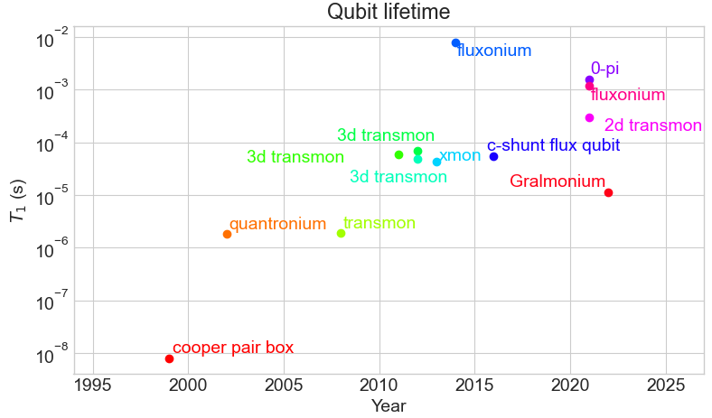
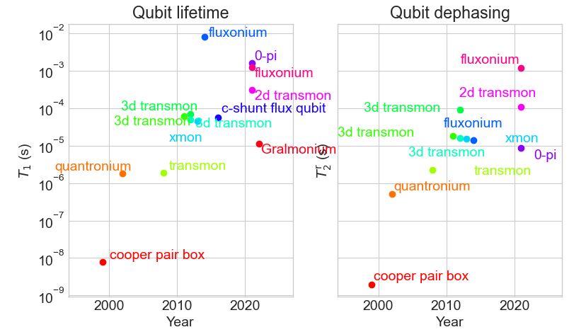

# qubit-ref

qubit-ref is a project aiming to keep track of qubits performances such as lifetime, coherence, gate fidelity, ... The ambition is to bring together all the references of relevent milestones.

## Why this project?

Some old people in the field of superconducting qubit may remember this figure of qubits lifetime as function of time showing the positive evolution of the different qubit flavors [1]. As time went by, that figure became more and more obsolete and so keeping an continuesouly updated figure was the starting point of this project.


## Visualization

Example of entries visualization are available on the jupyter notebook `visualization.ipynb`.

### Qubit lifetime



### Qubit coherence


### Ej/Ec ratio


## How entries are made?

The entire project is contained in one json file `data.json`. It contains all the bibtex references relevent to the evolution of qubit performances. From each paper, some numbers are extracted, for instance the qubit lifetime demonstrated in that paper, and entered in the reference of that particular paper with a comment of where that number was found. For instance if we take the first *transmon* paper[2], its bibtex entry converted in json format will give:
```json
"2008Schreier": {
    "author": "Schreier, J. A. and Houck, A. A. and Koch, Jens and Schuster, D. I. and Johnson, B. R. and Chow, J. M. and Gambetta, J. M. and Majer, J. and Frunzio, L. and Devoret, M. H. and Girvin, S. M. and Schoelkopf, R. J.",
    "doi": "10.1103/PhysRevB.77.180502",
    "issue": "18",
    "journal": "Phys. Rev. B",
    "month": "May",
    "numpages": "4",
    "pages": "180502",
    "publisher": "American Physical Society",
    "title": "Suppressing charge noise decoherence in superconducting charge qubits",
    "url": "https: //link.aps.org/doi/10.1103/PhysRevB.77.180502",
    "volume": "77",
    "year": "2008"
},
```

To this we will manually add the following entry:
* `"type": "transmon"`: the type of the qubit.
* `"t1": [1.87e-06, 2e-08],`: The lifetime of the qubit with its uncertainty.
* `"t2_ramsey": [ 2.22e-06, 3e-08],`: The dephasing time, measured through a Ramsey sequence, of the qubit with its uncertainty.
* `"ec": [380000000.0, np.nan"],`: Charging energy of the qubit (uncertainty not given so we give a numpy nan value).
* `"ej": [19000000000.0,"np.nan"],`: Josephson energy of the qubit (uncertainty not given so we give a numpy nan value).
* `"comments": "t1, t2_ramsey taken from paragraph 1, page 4. ec taken from fig 4 label. ej calculated from ej/ec~50 taken from fig 4 label.",`: Explanation of where the different manually entered entries came from.

The final entry is then:
```json
"2008Schreier": {
    "author": "Schreier, J. A. and Houck, A. A. and Koch, Jens and Schuster, D. I. and Johnson, B. R. and Chow, J. M. and Gambetta, J. M. and Majer, J. and Frunzio, L. and Devoret, M. H. and Girvin, S. M. and Schoelkopf, R. J.",
    "comments": "t1, t2_ramsey taken from paragraph 1, page 4. ec taken from fig 4 label. ej calculated from ej/ec~50 taken from fig 4 label.",
    "doi": "10.1103/PhysRevB.77.180502",
    "ec": [
        380000000.0,
        "np.nan"
    ],
    "ej": [
        19000000000.0,
        "np.nan"
    ],
    "issue": "18",
    "journal": "Phys. Rev. B",
    "month": "May",
    "numpages": "4",
    "pages": "180502",
    "publisher": "American Physical Society",
    "t1": [
        1.87e-06,
        2e-08
    ],
    "t2_ramsey": [
        2.22e-06,
        3e-08
    ],
    "title": "Suppressing charge noise decoherence in superconducting charge qubits",
    "type": "transmon",
    "url": "https: //link.aps.org/doi/10.1103/PhysRevB.77.180502",
    "volume": "77",
    "year": "2008"
},
```

## Development

You want to contribute? Great!

You find an error and want to correct it? Amazing!

If you're github aware, do not hesitate to make a pull request otherwise, open an issue and I will be pleased to discuss it with you.

## License

The source code of this project is licensed under the MIT license, which you can find in the `LICENSE` file.

You're using this resource for your presentation? Please be kind and cite us:
```
É. Dumur, qubit-ref, (2021), qubit-ref, https://github.com/charlespwd/qubit-ref/qubit-ref
```
The citation will be updated each time someone add its contribution to the project.


## References

* [1] Devoret, M. H. & Schoelkopf, R. J.
Superconducting Circuits for Quantum Information: An Outlook
Science, American Association for the Advancement of Science, **2013**, 339, 1169-1174

* [2] Schreier, J. A. et al.
Suppressing charge noise decoherence in superconducting charge qubits
Phys. Rev. B, American Physical Society, **2008**, 77, 180502